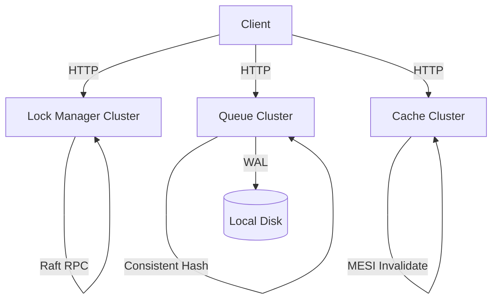

# Architecture

## Overview
Sistem terdiri dari tiga komponen utama:
- Distributed Lock Manager (Raft Consensus)
- Distributed Queue (Consistent Hashing + Write-Ahead Log)
- Distributed Cache Coherence (MESI Protocol + P2P Invalidation)

Semua node menggunakan aiohttp untuk komunikasi HTTP antar node (peer-to-peer). Tidak ada dependency database eksternal — semua state disimpan secara lokal di memori dan file WAL.

## Diagram

## Data Flow Ringkas
- Lock: request masuk ke leader (atau di-proxy oleh follower), dicatat di log Raft, di-commit dan diterapkan ke state machine.
- Queue: producer dan consumer diarahkan ke owner node berdasarkan consistent hashing; data disimpan di in-memory deque dan di-persist ke file WAL lokal.
- Cache: write memicu invalidasi broadcast P2P ke node lain; read miss mencari data dari peer nodes, lalu fallback ke memory storage lokal. State MESI (M/E/S/I) dikelola sepenuhnya di dalam memori.
